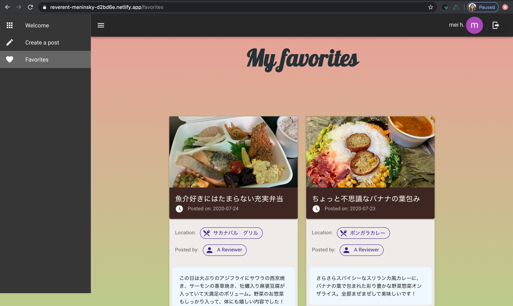

# Food Review App

This is a capstone project for Udacity Cloud Developer Nanodgree.

## Functionality of the application

This application will allow creating/removing/updating/fetching Food Review items.

Once logged in, each user can:
* View all food reviews including the ones other people have created
* Mark/View favorite food reviews
* Post a new food review
* Edit/Delete Food Reviews that he/she has created

## Technology stack
* Frontend: Nuxt.js with Vuetify
* Backend: AWS Lambda with API Gateway
* Datastore: AWS DynamoDB
* Storage (for images): AWS S3
* Authentication: Auth0
* Backend deployment: Serverless framework
* Frontend hosting: Netlify

## Demo site

https://reverent-meninsky-d2bd6e.netlify.app/

## Screenshot

## API endpoints

An user must be authenticated to call these APIs.

### For food reviews
| Functionality | Method | Endpoint |
|---|---|---|
| Get food reviews per user | GET | https://{foodApiId}.execute-api.us-east-1.amazonaws.com/dev/myreview |
| Get all food reviews | GET | https://{foodApiId}.execute-api.us-east-1.amazonaws.com/dev/review/ |
| Get a food review by ID | GET | https://{foodApiId}.execute-api.us-east-1.amazonaws.com/dev/review/{foodReviewId} |
| Post a food review | POST | https://{foodApiId}.execute-api.us-east-1.amazonaws.com/dev/review |
| Update a food review | PATCH | https://{foodApiId}.execute-api.us-east-1.amazonaws.com/dev/review/{foodReviewId} |
| Delete a food review | DELETE | https://{foodApiId}.execute-api.us-east-1.amazonaws.com/dev/review/{foodReviewId} |
| Generate a signed URL for image upload | POST | https://{foodApiId}.execute-api.us-east-1.amazonaws.com/dev/review/{foodReviewId}/attachment |

### For favorites

| Functionality | Method | Endpoint |
|---|---|---|
| Get favorites per user | GET | https://{foodApiId}.execute-api.us-east-1.amazonaws.com/dev/favorite |
| Post a favorite | POST | https://{foodApiId}.execute-api.us-east-1.amazonaws.com/dev/favorite/{foodReviewId} |
| Delete a favorite| DELETE | https://{foodApiId}.execute-api.us-east-1.amazonaws.com/dev/favorite/{foodReviewId} |

## Lambda functions

### For common use
* Auth: food-review-app-dev-Auth
* GenerateUploadUrl: food-review-app-dev-GenerateUploadUrl

### For food reviews
* GetFoodReviews: food-review-app-dev-GetFoodReviews
* GetAllFoodReviews: food-review-app-dev-GetAllFoodReviews
* GetFoodReviewById: food-review-app-dev-GetFoodReviewById
* CreateFoodReview: food-review-app-dev-CreateFoodReview
* UpdateFoodReview: food-review-app-dev-UpdateFoodReview
* DeleteFoodReview: food-review-app-dev-DeleteFoodReview

### For favorites
* GetFavoriteReviews: food-review-app-dev-getFavoriteReviews
* CreateFavoriteReview: food-review-app-dev-CreateFavoriteReview
* DeleteFavoriteReview: food-review-app-dev-DeleteFavoriteReview
